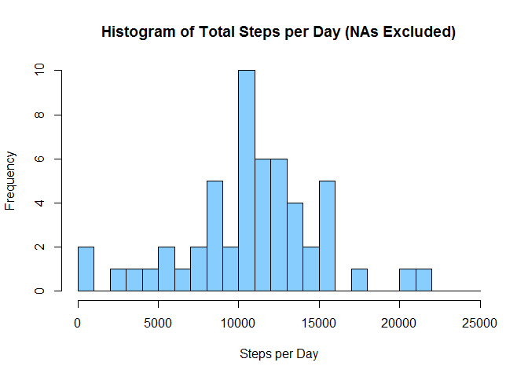
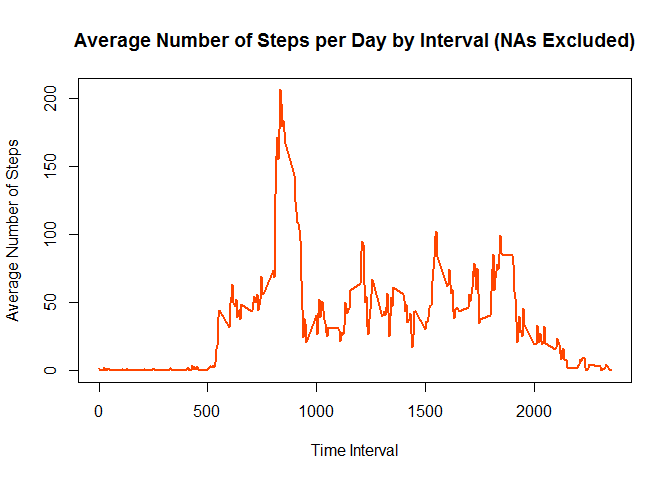
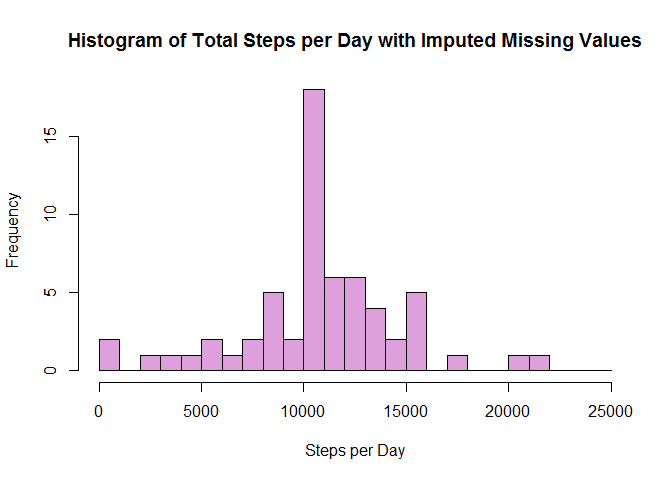
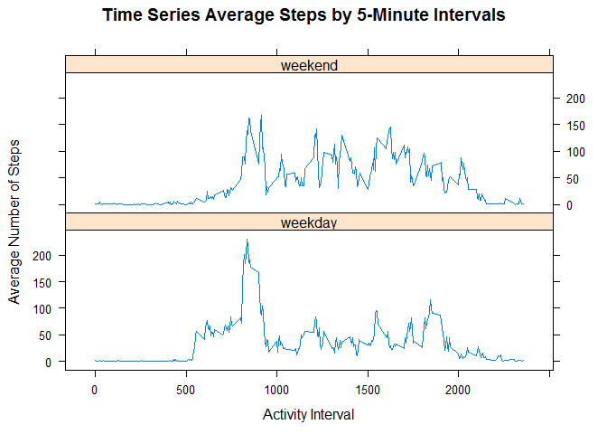

### Analysis of Collected Weekly Activity Data

The purpose of this project is to analyze personal activity data
collected from a monitoring device using FitBit. The device collects
data at 5 minute intervals on a 24 hour period. The project includes two
months of personal activity data collected from a subject in 2012 from
November through December.

Three variables are included with the sample dataset.

-   steps: Numeric value of the number of steps taking within a
    5-minute interval. NA represents Any missing values.
-   date: Date when the measurement was taken
-   interval: Integer value indicating the 5-minute interval when the
    measurement was taken.

The dataset of 17,568 observations is stored in a comma-separated-value
(CSV) file.

#### Loading and pre-processing the data

1.  Load the data
2.  Process/transform the data into a tidy dataset

<!-- -->

    ## 
    ## Attaching package: 'dplyr'

    ## The following objects are masked from 'package:stats':
    ## 
    ##     filter, lag

    ## The following objects are masked from 'package:base':
    ## 
    ##     intersect, setdiff, setequal, union

    ## 
    ## Attaching package: 'lubridate'

    ## The following object is masked from 'package:base':
    ## 
    ##     date

    # read data from file
    dataset <- read.csv("./data/activity.csv")

    # convert date variable to date format
    dataset$date <- ymd(dataset$date)

#### What is mean total number of steps taken per day?

(Missing values are ignored for this part of the project.)

1.  Calculate the total number of steps taken per day

<!-- -->

    # Group data by date excluding NA values
    stepsbyday <- aggregate(steps~date,data=dataset, sum)

1.  Histogram of the total number of steps taken per day

<!-- -->

    hist(stepsbyday$steps,col="skyblue1", main="Histogram of Total Steps per Day (NAs Excluded)", xlab="Steps per Day", breaks=seq(from=0,to=25000,by=1000))

1.  Calculate and report the mean and median of the total number of
    steps taken per day

<!-- -->

    mean_steps <- format(mean(stepsbyday$steps, na.rm=TRUE), scientific = FALSE)
    mean_steps

    ## [1] "10766.19"

    median_steps <- median(stepsbyday$steps, na.rm=TRUE)
    median_steps

    ## [1] 10765

The mean of the total number of steps taken per day: **10766.19**.  
The median of the total number of steps taken per day: **10765**.

#### What is the average daily activity pattern?

1.  Time series graph of the 5-minute interval on the x-axis and the
    average number of steps taken, averaged across all days on
    the y-axis.

<!-- -->

    # Steps by interval
    interval_steps <- aggregate(steps~interval,data=dataset, mean)

    plot(interval_steps$interval,interval_steps$steps,col="orangered",type="l", lwd=2,  main="Average Number of Steps per Day by Interval (NAs Excluded)", xlab="Time Interval", ylab="Average Number of Steps")

#### Imputing missing values

**Note** There are a number of days/intervals where there are missing
(NA) values

1.  Calculate and report the total number of missing values in the
    dataset

The summary of the dataset tells us that the total number of missing
values is 2304 but it can also be calculated as follows:

    # Total stesps with NA values
    missing <- sum(is.na(dataset$steps))

Total number of missing (NA values) is **2304**.

1.  Create a new dataset as the original with the missing values
    filled in.

<!-- -->

    imputed_dataset <-transform(dataset, steps=ifelse(is.na(dataset$steps), interval_steps$steps[match(dataset$interval, interval_steps$interval)], dataset$steps))

1.  Make a histogram of the total number of steps taken each day.
    Calculate and report the mean and median of the total number of
    steps taken per day.

<!-- -->

    # Total number of steps with imputed values
    imputed_totals <- aggregate(steps~date,data=imputed_dataset,sum)

    mean_imputed_steps <- format(mean(imputed_totals$steps, na.rm=TRUE), scientific = FALSE)
    mean_imputed_steps

    ## [1] "10766.19"

    median_imputed_steps <- format(median(imputed_totals$steps, na.rm=TRUE),scientific = FALSE)
    median_imputed_steps

    ## [1] "10766.19"

    eval=TRUE
    hist(imputed_totals$steps,col="plum", main="Histogram of Total Steps per Day with Imputed Missing Values", xlab="Steps per Day", breaks=seq(from=0,to=25000,by=1000))

 The
mean of total number of steps taken per day with imputed values is
**10766.19**.  
The median of total number of steps taken per day with imputed values is
**10766.19**.

#### Are there differences in activity patterns between weekdays and weekends?

Use the dataset with the imputed values for this part of the project.

1.  Create a new factor variable in the dataset with two levels --
    'weekday' and 'weekend' to indicate whether a given dadate is a
    weekday or a weekend.

<!-- -->

    # Compare weekday and weekend activity
    # Add a new variable with a weekday and a weekend factor
    day_activity <- imputed_dataset
    day_activity <- mutate(day_activity, daytype=ifelse(weekdays(day_activity$date,abbreviate = F) %in% c('Saturday','Sunday'),"weekend","weekday"))
    day_activity$daytype <- as.factor(day_activity[,"daytype"])

    meandayactivity <- aggregate(steps~interval+daytype,day_activity,mean)

1.  Create a time series graph of the 5-minute interval (x-axis) and the
    average number of steps taken and averaged across all weekday days
    or weekend days (y-axis.)

<!-- -->

    library("lattice")
    # 2 panel time series plot of activity on weekdays vs weekends
    xyplot(meandayactivity$steps~meandayactivity$interval | meandayactivity$daytype,layout=c(1,2),type="l",xlab="Activity Interval", ylab="Average Number of Steps", main="Time Series Average Steps by 5-Minute Intervals")

